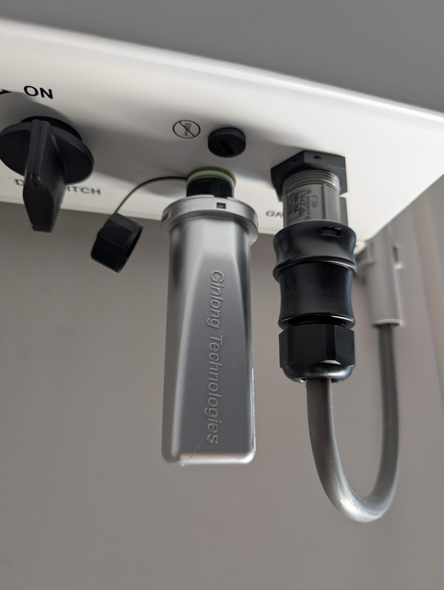
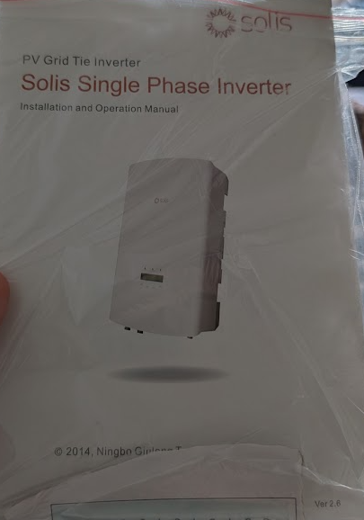

# Solis MK5 Local

> **Note:** All code in this repository was written with AI assistance. I
> built this for my own use on my own installation, and I'm sharing it in
> case it's useful to others too. It is based on two other open-source
> repositories as a starting point (see Credits below).

Local Home Assistant integration for Solis/Ginlong inverters with a Wi-Fi
stick logger. The stick sends its data directly (over TCP) to Home
Assistant — **no cloud, no polling, no extra hardware**. You use a free
"Remote Server" slot on the stick for this, so the Solis cloud and app keep
working as usual through the existing slot.

The protocol was reverse-engineered from raw captures of a stick with
hardware `GL17-07-261-D` and firmware `H4.01.51`; all field positions have
been validated against the logger's own web interface.



The stick this integration targets: a Ginlong Technologies Wi-Fi logger
plugged directly into the communication port under the inverter's terminal
cover, next to the DC switch. If your stick looks like this, it's very
likely the same protocol.

## Sensors

| Sensor | Unit | Note |
|---|---|---|
| Power | W | current AC power |
| Yield today | kWh | suitable for the Energy Dashboard |
| Yield total | kWh | suitable for the Energy Dashboard |
| Inverter temperature | °C | |
| Grid voltage / grid current / grid frequency | V / A / Hz | diagnostic |
| DC voltage and current string 1 and 2 | V / A | per MPPT string, diagnostic |
| Last update | timestamp | with the raw hex of the last frame as attribute |

The data is pushed by the stick approximately every 6 minutes.

## Installation via HACS

This repository is not in the default HACS list, so add it as a custom
repository:

1. Open HACS in Home Assistant.
2. Click the three dots in the top right > "Custom repositories".
3. Enter `https://github.com/bart7782/ha-solis-mk5-local` as the Repository
   and choose "Integration" as the category.
4. Click "Add", then search for "Solis MK5 Local" in HACS and click
   "Download".
5. Restart Home Assistant.

## Installation (manual, without HACS)

1. Copy the `custom_components/solis_mk5_local` folder to the
   `custom_components` folder of your Home Assistant configuration.
2. Restart Home Assistant.

## Configuration

1. Settings > Devices & Services > Add Integration > "Solis MK5 Local".
2. Enter a free TCP port, for example 5657 (must differ from any ports
   already in use).
3. Go to your Solis logger's web interface, Advanced > Remote server, and
   set a **free** slot (for example Server C) to:
   - IP address: the IP address of your Home Assistant server
   - Port: the same port as in step 2
   - Connection: TCP
4. Save and restart the logger. Data will appear within ~6 minutes.

> **Running Home Assistant in Docker?** The chosen port must be published to
> the host (e.g. `-p 5657:5657`) or the stick cannot reach it. Home Assistant
> OS and Supervised installs need no extra step.

Via "Options" on the integration you can configure after how many minutes
of silence the measurement sensors are marked "unavailable" (default 30).

## Troubleshooting

**No data after ~10 minutes?** Work through this list:

1. **Right IP and port?** In the logger's web interface, double-check the
   Remote Server slot points at your Home Assistant IP and the exact port you
   entered when adding the integration.
2. **Free slot used?** Use a slot that isn't already taken by the Solis cloud
   (typically Server A). Overwriting the cloud slot breaks the app; use a free
   one (e.g. Server C) instead.
3. **Same network / reachable?** The stick must be able to open a TCP
   connection to Home Assistant. Check firewalls and, for Docker, that the
   port is published (see the note above).
4. **Logger restarted?** Some loggers only apply Remote Server changes after a
   reboot. Restart it (or power-cycle the inverter) and wait ~6 minutes.
5. **Still nothing?** Enable debug logging (below) and look for
   "Connection opened from ..." lines. If you see connections but no parsed
   data, the logger likely speaks a different protocol variant — please open
   an issue using the "Unsupported logger" template.

## Reporting an unsupported logger

If a Repairs entry appears (Settings > System > Repairs) saying the logger
sends an unrecognised protocol, or connections arrive but no sensors fill in,
your stick is probably a different generation than the one this was built for.
That's fixable with a few captured frames:

1. Enable debug logging (see below).
2. Wait for a couple of pushes so a few frames are logged.
3. Open an issue with the
   [Unsupported logger template](https://github.com/bart7782/ha-solis-mk5-local/issues/new?template=unsupported_logger.yml)
   and paste the hex lines, plus the readings from the logger's own web page
   at that moment so the byte positions can be checked.

## Good to know

- **At night** the inverter powers off and the stick stops sending. The
  measurement sensors (power, voltages, currents) then become
  "unavailable"; the energy sensors keep their last value and also survive
  a Home Assistant restart.
- **Energy Dashboard**: use "Yield today" or "Yield total" as your solar
  production source.
- **Example dashboard**: [`examples/solar-dashboard.yaml`](examples/solar-dashboard.yaml)
  contains a complete solar dashboard (power gauge, yield per day, history,
  MPPT strings and grid diagnostics) that you can paste in via the Raw
  configuration editor. Make sure to replace the entity IDs with those of
  your own installation first — see the notes at the top of the file.
- **Frames with a different layout** (different firmware/hardware) are not
  silently parsed incorrectly: every frame is validated on checksum,
  length and plausibility. Rejected frames appear with a full hex dump in
  the log. If several frames in a row get rejected, the integration raises
  a Repairs entry (Settings > System > Repairs) so it's clear the connected
  logger is speaking a variant this integration doesn't recognise, instead
  of silently doing nothing.
- Enable debug logging with:

  ```yaml
  logger:
    logs:
      custom_components.solis_mk5_local: debug
  ```

## Protocol documentation



Developed and tested against a Solis single-phase grid-tie inverter (the
manual pictured above), paired with the Ginlong stick shown earlier — this
is the exact hardware combination the byte map below was reverse-engineered
from.

For those who want to hack on this themselves: the stick opens a connection
roughly every 6 minutes and sends one burst with two frames (`0x68 ... 0x16`,
checksum = sum of all bytes after the start byte modulo 256):

- a **data frame** of 103 bytes (control code `51 b0`) with the telemetry;
- an **info frame** of 55 bytes (control code `51 b1`) with the firmware
  versions and the hardware model as ASCII.

The full byte map is documented in
[`protocol.py`](custom_components/solis_mk5_local/protocol.py), and
[`tests/test_protocol.py`](tests/test_protocol.py) contains real captures
with their expected values. Tests run without Home Assistant:

```
python tests/test_protocol.py
```

## Credits

Inspired by the reverse-engineering work of
[planetmarshall/solis-service](https://github.com/planetmarshall/solis-service)
and [Rapsssito/local-solis-ginglong-inverter](https://github.com/Rapsssito/local-solis-ginglong-inverter),
with additional reference from
[avlemos/ha_solis_server](https://github.com/avlemos/ha_solis_server).
This stick generation (MK5, `GL17-...`) speaks an older protocol than those
integrations support; hence this separate implementation.
